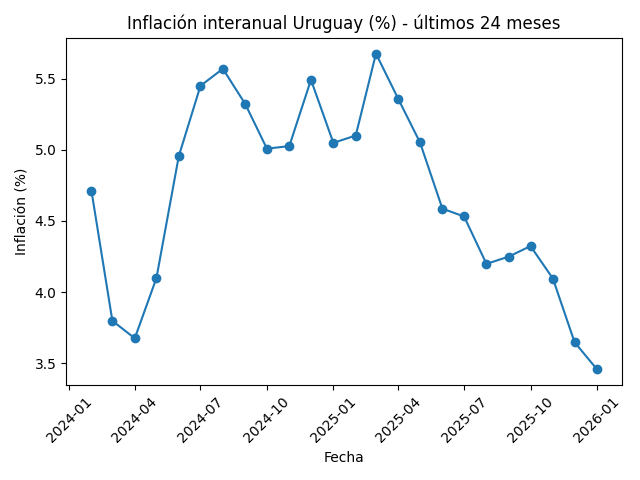
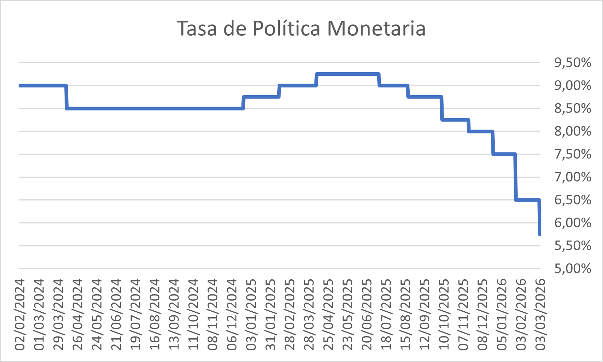
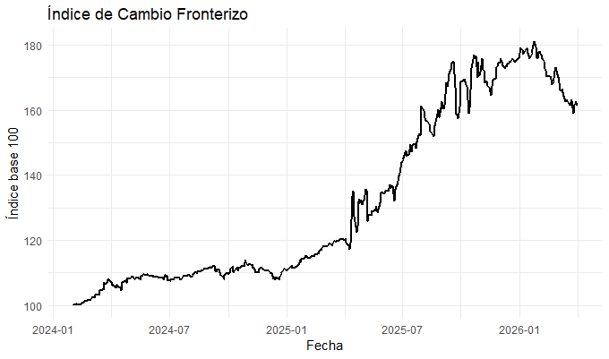

# boletin-economico-litoral
Boletín de análisis económico regional enfocado en inflación, política monetaria y dinámica fronteriza del litoral uruguayo.
# Boletín Económico del Litoral

Autor: Adolfo Fernández

## Descripción

El Boletín Económico del Litoral es un proyecto de análisis económico regional enfocado en la evolución de variables macroeconómicas relevantes para Uruguay y especialmente para las ciudades del litoral.

El objetivo del proyecto es generar información clara y visualmente accesible para empresarios, comerciantes, estudiantes y actores institucionales interesados en la dinámica económica regional.

El boletín integra indicadores macroeconómicos nacionales junto con análisis específicos sobre la economía de frontera y el diferencial cambiario con Argentina.

---

## Indicadores incluidos

- Inflación
- Tasa de Política Monetaria (TPM)
- Tipo de cambio regional
- Índice de Cambio Fronterizo (ICF)
- Análisis económico regional

---

## Índice de Cambio Fronterizo (ICF)

El Índice de Cambio Fronterizo (ICF) es un indicador de elaboración propia que aproxima el incentivo económico a realizar compras transfronterizas desde Uruguay hacia Argentina.

La metodología utilizada es:

ICF = USD/ARS ÷ USD/UYU

---
## Última edición

[Descargar boletín PDF](output/Boletín_Económico_Abril_26.pdf)
---

## Contenido del repositorio

```text
data/      -> bases de datos utilizadas
scripts/   -> scripts en R para procesamiento y visualización
graficos/  -> gráficos generados para el boletín
output/    -> versiones PDF del boletín
```

---

## Tecnologías utilizadas

- R
- tidyverse
- ggplot2
- RMarkdown

---

## Fuente de datos

- Banco Central del Uruguay (BCU)
- INE Uruguay
- Mercados financieros regionales

---
## Visualizaciones

### Inflación



### Tasa de Política Monetaria



### Índice de Cambio Fronterizo


## Estado del proyecto
---
Proyecto actualmente en desarrollo y expansión.

Las futuras versiones incluirán:
- automatización de actualización de datos
- dashboard interactivo
- nuevos indicadores regionales
- visualizaciones avanzadas
